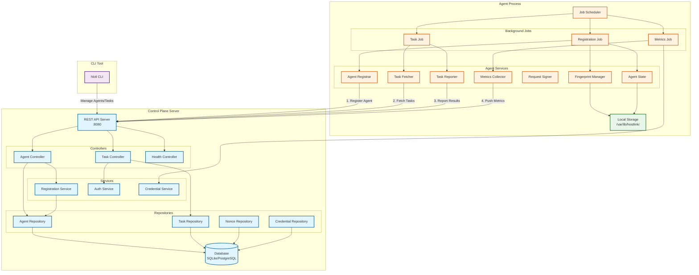
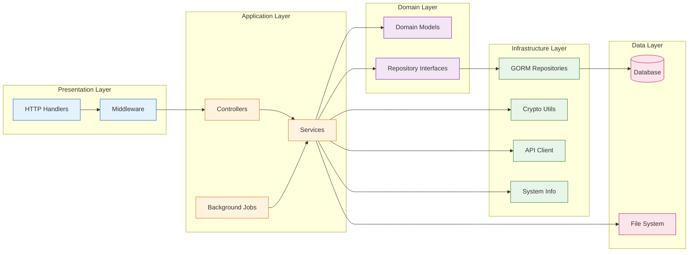
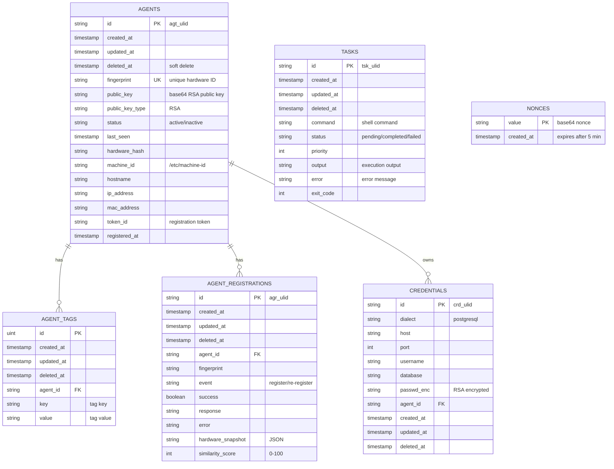
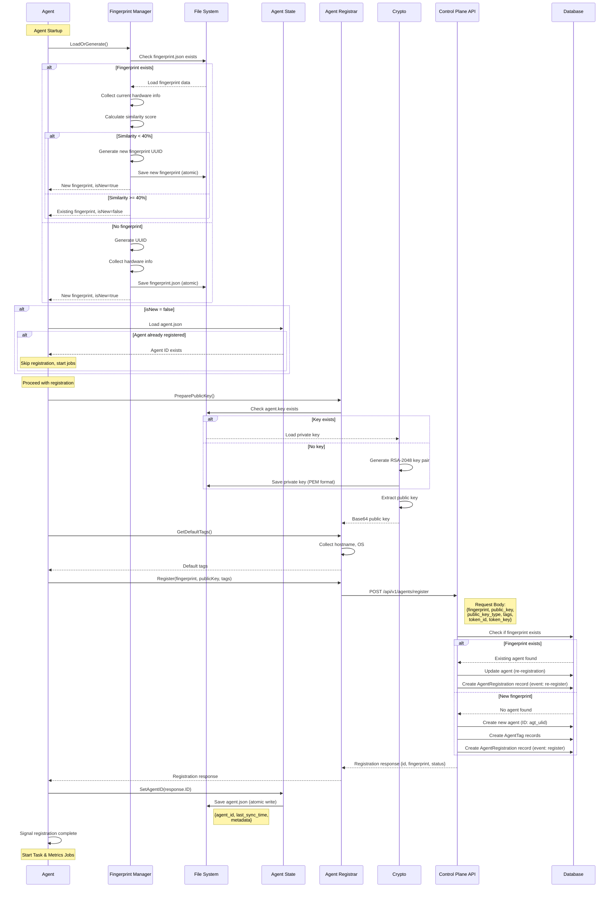
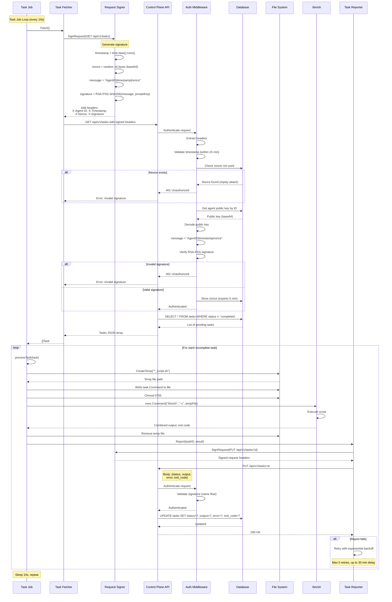
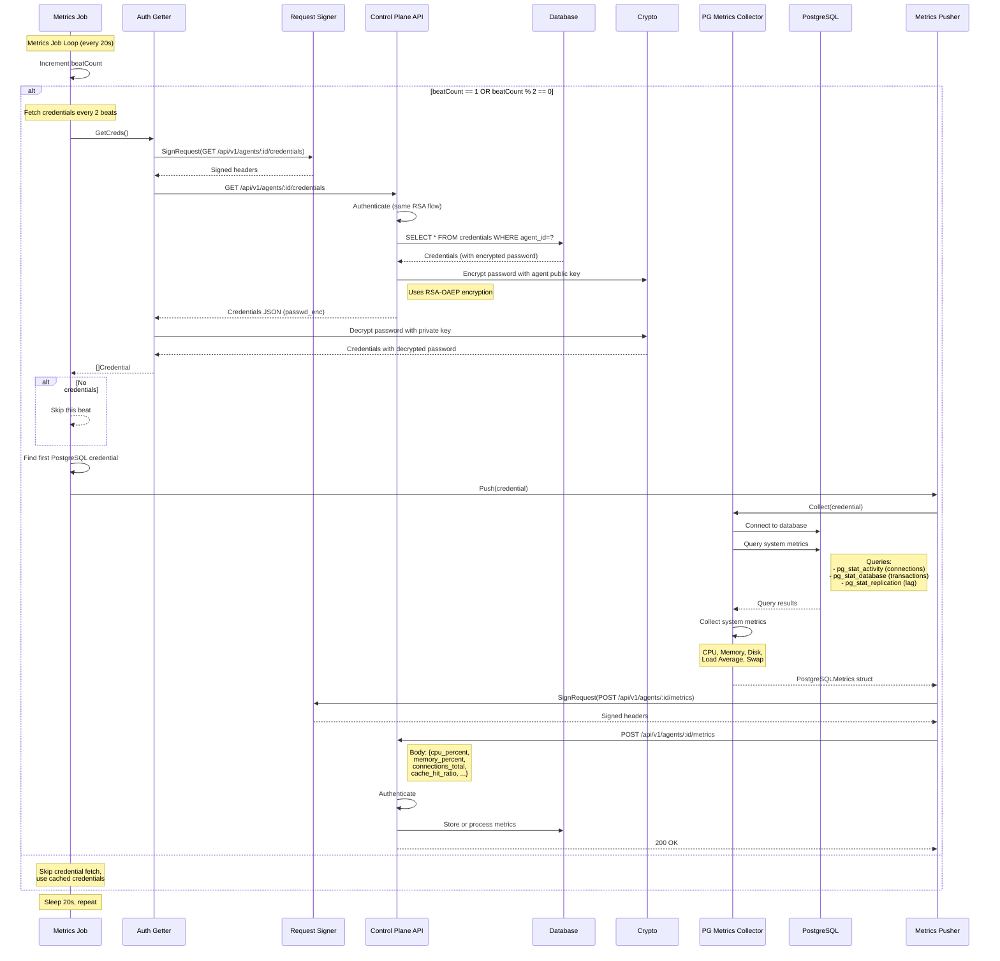
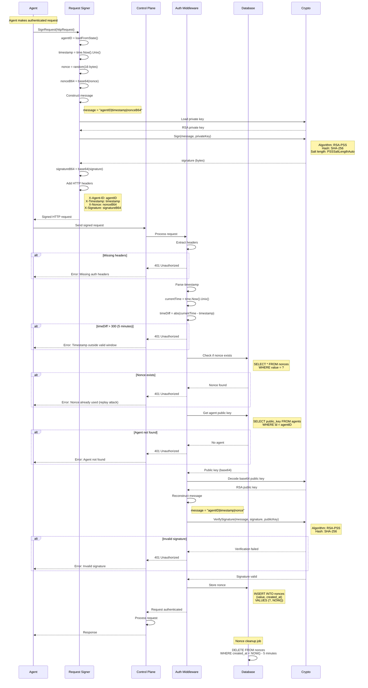

# Hostlink Architecture Documentation

## Table of Contents
1. [System Overview](#system-overview)
2. [High-Level Architecture](#high-level-architecture)
3. [Database Schema](#database-schema)
4. [Agent Registration Flow](#agent-registration-flow)
5. [Task Execution Flow](#task-execution-flow)
6. [Metrics Collection Flow](#metrics-collection-flow)
7. [Authentication Flow](#authentication-flow)
8. [Component Details](#component-details)
9. [API Reference](#api-reference)
10. [Configuration](#configuration)

---

## System Overview

Hostlink is an agent-based task execution system that enables remote software management on host machines. The system consists of three main components:

1. **Control Plane Server** - REST API server that manages agents and tasks
2. **Agent** - Background service that registers with the server, polls for tasks, and executes them
3. **hlctl** - CLI tool for managing agents and tasks

Both the control plane server and agent are compiled from the same codebase, using different entry points.

### Key Features

- **One-Way RSA-PSS Authentication**: Agents authenticate to the server using RSA digital signatures
- **Hardware Fingerprinting**: Unique device identification based on hardware characteristics
- **Task Execution**: Remote command execution with output capture
- **Metrics Collection**: PostgreSQL database metrics monitoring
- **Atomic Operations**: Safe concurrent operations with file locking
- **Retry Logic**: Exponential backoff for reliable communication

---

## High-Level Architecture



### Architecture Layers



---

## Database Schema



### Database Relationships

- **Agents ↔ Agent Tags**: One-to-Many relationship for metadata tagging
- **Agents ↔ Agent Registrations**: One-to-Many relationship for registration history
- **Agents ↔ Credentials**: One-to-Many relationship for database credentials
- **Tasks**: Independent table, no direct foreign key (agents fetch by status)
- **Nonces**: Independent table for replay attack prevention

### Key Indexes

- `agents.fingerprint` - Unique index for fast fingerprint lookup
- `agents.id` - Primary key index
- `agent_tags.agent_id` - Foreign key index
- `agent_registrations.agent_id` - Foreign key index
- `tasks.status` - Index for filtering pending tasks
- `nonces.created_at` - Index for expiry cleanup

---

## Agent Registration Flow



### Registration Job Details

**Trigger Pattern**: Exponential backoff retry
- Initial delay: 10 seconds
- Max retries: 5
- Backoff: 10s → 20s → 40s → 80s → 160s

**Fingerprint Components**:
- Machine ID (from `/etc/machine-id` or `/var/lib/dbus/machine-id`)
- Hardware hash (combined hash of CPU, memory, disks)
- Hostname
- IP Address
- MAC Address

**Hardware Similarity Calculation**:
- Compares current hardware with stored fingerprint
- Score based on matching components
- Threshold: 40% (if < 40%, considered new device)

**File Locations**:
- Private key: `/var/lib/hostlink/agent.key`
- Fingerprint: `/var/lib/hostlink/fingerprint.json`
- Agent state: `/var/lib/hostlink/agent.json`

---

## Task Execution Flow



### Task Execution Details

**Task Job Configuration**:
- Trigger: Continuous loop with 10-second intervals
- Starts after: Agent registration completes
- Concurrent execution: Sequential (one task at a time)

**Script Execution**:
- Creates temporary file with pattern `*_script.sh`
- Permissions: `0755` (executable)
- Execution: `/bin/sh -c <script_path>`
- Output: Combined stdout and stderr
- Cleanup: Temp file removed after execution

**Task Reporter Retry Logic**:
- Max retries: 5
- Backoff: Exponential (1s → 2s → 4s → 8s → 16s)
- Max delay: 30 minutes between retries
- Failure handling: Logs error, continues to next task

**Task Status**:
- `pending` - Task created, not yet executed
- `completed` - Task executed successfully (exit code 0)
- `failed` - Task execution failed (error during execution)

---

## Metrics Collection Flow



### Metrics Collection Details

**Metrics Job Configuration**:
- Trigger: Continuous loop with 20-second intervals
- Credential fetch: Every 2 beats (first beat always fetches)
- Starts after: Agent registration completes

**Credential Encryption**:
- Server encrypts password with agent's **public key** (RSA-OAEP)
- Agent decrypts with its **private key**
- Ensures credentials are protected in transit

**PostgreSQL Metrics Collected**:

System Metrics:
- CPU usage percentage
- Memory usage percentage
- Load average (1, 5, 15 minutes)
- Disk usage percentage
- Swap usage percentage

Database Metrics:
- Total connections
- Connections per database
- Replication lag (seconds)
- Cache hit ratio
- Transactions per second

**Collector Queries**:
```sql
-- Connections
SELECT count(*) FROM pg_stat_activity;

-- Transactions
SELECT sum(xact_commit + xact_rollback) FROM pg_stat_database;

-- Replication lag
SELECT EXTRACT(EPOCH FROM (now() - pg_last_xact_replay_timestamp()));

-- Cache hit ratio
SELECT sum(blks_hit) / (sum(blks_hit) + sum(blks_read)) FROM pg_stat_database;
```

---

## Authentication Flow



### Authentication Security Features

**One-Way Authentication**:
- Only agent authenticates to server
- Server does not authenticate to agent
- Prevents server impersonation attacks

**RSA-PSS Signature**:
- Algorithm: RSA Probabilistic Signature Scheme
- Key size: 2048 bits
- Hash: SHA-256
- Salt length: Auto (same as hash length)

**Replay Attack Prevention**:
- **Timestamp validation**: ±5 minute window
- **Nonce validation**: One-time use, stored in database
- **Nonce expiry**: Automatically deleted after 5 minutes

**Message Format**:
```
message = "AgentID|Timestamp|Nonce"
Example: "agt_01HQWE123|1700000000|abc123xyz"
```

**HTTP Headers**:
- `X-Agent-ID`: Agent identifier (agt_ulid)
- `X-Timestamp`: Unix timestamp (seconds)
- `X-Nonce`: Base64-encoded random bytes (16 bytes)
- `X-Signature`: Base64-encoded RSA-PSS signature

**Protected Endpoints**:
- `/api/v1/tasks` - Task management (GET, POST, PUT)
- `/api/v1/agents/:id/credentials` - Credential retrieval
- `/api/v1/agents/:id/metrics` - Metrics reporting

**Unprotected Endpoints**:
- `/api/v1/agents/register` - Token-based authentication
- `/api/v2/*` - Legacy endpoints (to be removed)
- `/health` - Health check

---

## Component Details

### Control Plane Server

#### Agent Controller
**File**: `app/controller/agents/agent_controller.go`

**Responsibilities**:
- Agent registration and re-registration
- Agent listing and retrieval
- Credential management

**Key Endpoints**:
- `POST /api/v1/agents/register` - Register new agent or re-register existing
- `GET /api/v1/agents` - List all agents with filters
- `GET /api/v1/agents/:id` - Get specific agent details
- `GET /api/v1/agents/:id/credentials` - Get agent credentials (encrypted)

**Registration Logic**:
1. Validate request (fingerprint, public key, token)
2. Check if fingerprint exists in database
3. If exists: Update agent, create re-registration record
4. If new: Create agent with ULID, create tags, create registration record
5. Return agent ID and registration status

#### Task Controller
**File**: `app/controller/tasks/task_controller.go`

**Responsibilities**:
- Task creation
- Task listing with filters
- Task updates (status, output, error)

**Key Endpoints**:
- `POST /api/v1/tasks` - Create new task
- `GET /api/v1/tasks` - List tasks (filtered by status, priority)
- `GET /api/v1/tasks/:id` - Get task details
- `PUT /api/v1/tasks/:id` - Update task (report results)

**Task Creation**:
1. Validate command (non-empty)
2. Generate task ID (tsk_ulid)
3. Set default status: "pending"
4. Store in database
5. Return task details

#### Auth Middleware
**File**: `app/middleware/agentauth/auth.go`

**Responsibilities**:
- Verify RSA signatures on requests
- Validate timestamps
- Prevent replay attacks with nonces

**Authentication Steps**:
1. Extract headers (X-Agent-ID, X-Timestamp, X-Nonce, X-Signature)
2. Validate timestamp within ±5 minute window
3. Check nonce not already used
4. Retrieve agent's public key from database
5. Verify RSA-PSS signature
6. Store nonce to prevent replay
7. Allow request to proceed

### Agent Services

#### Fingerprint Manager
**File**: `app/services/fingerprint/fingerprint.go`

**Responsibilities**:
- Generate unique hardware-based fingerprint
- Detect hardware changes
- Atomic file operations

**Fingerprint Components**:
```json
{
  "fingerprint": "uuid-v4",
  "hardware_hash": "sha256",
  "machine_id": "from /etc/machine-id",
  "hostname": "server1",
  "ip_address": "192.168.1.10",
  "mac_address": "00:1A:2B:3C:4D:5E",
  "created_at": "2024-11-22T..."
}
```

**Hardware Similarity Algorithm**:
- Compare MachineID (primary indicator)
- If MachineID differs: Calculate hardware hash similarity
- Similarity < 40%: Treat as new device
- Similarity >= 40%: Keep existing fingerprint

**File Operations**:
- Atomic writes: Write to temp file, then rename
- Mutex protection: Prevents concurrent modifications
- Error handling: Rollback on failure

#### Agent Registrar
**File**: `app/services/agentregistrar/registrar.go`

**Responsibilities**:
- Prepare RSA public key
- Generate default tags
- Send registration request to control plane

**Public Key Preparation**:
1. Check if private key exists at `HOSTLINK_PRIVATE_KEY_PATH`
2. If not: Generate new RSA-2048 key pair, save to file
3. If exists: Load existing private key
4. Extract public key (PKIX format)
5. Encode as base64 for transmission

**Default Tags**:
- `hostname`: System hostname
- `os`: Operating system (linux, darwin, windows)

#### Task Fetcher
**File**: `app/services/taskfetcher/taskfetcher.go`

**Responsibilities**:
- Poll control plane for pending tasks
- Sign requests with RSA signature

**Implementation**:
```go
func (tf *TaskFetcher) Fetch() ([]task.Task, error) {
    req := client.NewRequest("GET", "/api/v1/tasks")
    signer.SignRequest(req)
    resp := client.Do(req)
    return parseTasksJSON(resp)
}
```

#### Task Reporter
**File**: `app/services/taskreporter/taskreporter.go`

**Responsibilities**:
- Report task execution results
- Retry with exponential backoff

**Report Structure**:
```go
type TaskResult struct {
    Status   string // "completed" or "failed"
    Output   string // stdout + stderr
    Error    string // error message if failed
    ExitCode int    // process exit code
}
```

**Retry Configuration**:
- Initial delay: 1 second
- Backoff multiplier: 2x
- Max retries: 5
- Max delay: 30 minutes

#### Request Signer
**File**: `app/services/requestsigner/signer.go`

**Responsibilities**:
- Sign HTTP requests with RSA-PSS
- Generate nonces
- Add authentication headers

**Signing Process**:
```go
func (s *Signer) SignRequest(req *http.Request) error {
    agentID := loadAgentID()
    timestamp := time.Now().Unix()
    nonce := generateNonce() // 16 random bytes, base64

    message := fmt.Sprintf("%s|%d|%s", agentID, timestamp, nonce)
    signature := rsaSign(message, privateKey) // RSA-PSS-SHA256

    req.Header.Set("X-Agent-ID", agentID)
    req.Header.Set("X-Timestamp", strconv.FormatInt(timestamp, 10))
    req.Header.Set("X-Nonce", nonce)
    req.Header.Set("X-Signature", base64(signature))

    return nil
}
```

#### Agent State
**File**: `app/services/agentstate/agentstate.go`

**Responsibilities**:
- Persist agent registration state
- Store agent ID for subsequent requests

**State File Format** (`agent.json`):
```json
{
  "agent_id": "agt_01HQWE123ABC",
  "last_sync_time": "2024-11-22T10:30:00Z",
  "metadata": {
    "registered_at": "2024-11-20T08:00:00Z"
  }
}
```

**Operations**:
- `Load()` - Read state from file
- `SetAgentID(id)` - Save agent ID (atomic write)
- `GetAgentID()` - Retrieve stored agent ID

#### Metrics Collector
**File**: `internal/pgmetrics/collector.go`

**Responsibilities**:
- Collect PostgreSQL database metrics
- Collect system metrics (CPU, memory, disk)

**Metrics Structure**:
```go
type PostgreSQLMetrics struct {
    // System metrics
    CPUPercent       float64
    MemoryPercent    float64
    LoadAvg1         float64
    LoadAvg5         float64
    LoadAvg15        float64
    DiskUsagePercent float64
    SwapUsagePercent float64

    // Database metrics
    ConnectionsTotal      int
    ConnectionsPerDB      map[string]int
    ReplicationLagSeconds int
    CacheHitRatio         float64
    TransactionsPerSecond float64
}
```

### Background Jobs

#### Registration Job
**File**: `app/jobs/registrationjob/registrationjob.go`

**Trigger**: Once on startup with exponential backoff
- Initial delay: 10 seconds
- Max retries: 5
- Backoff: 10s → 20s → 40s → 80s → 160s

**Execution Flow**:
1. Load or generate hardware fingerprint
2. Check if already registered (skip if not new fingerprint)
3. Prepare RSA public key
4. Collect default tags
5. Send registration request
6. Save agent ID to state file
7. Signal completion (unblocks task and metrics jobs)

#### Task Job
**File**: `app/jobs/taskjob/taskjob.go`

**Trigger**: Continuous loop with 10-second intervals

**Execution Flow**:
1. Fetch tasks from control plane
2. Filter for incomplete tasks (status != "completed")
3. For each task:
   - Create temp script file (`*_script.sh`)
   - Write command to file
   - Set execute permissions (0755)
   - Execute with `/bin/sh -c`
   - Capture combined output
   - Report results to control plane
   - Remove temp file

**Concurrency**: Sequential execution (one task at a time)

#### Metrics Job
**File**: `app/jobs/metricsjob/metricsjob.go`

**Trigger**: Continuous loop with 20-second intervals

**Execution Flow**:
1. Check if should fetch credentials (every 2 beats)
2. If yes: Fetch credentials from control plane
3. Find first PostgreSQL credential
4. Collect metrics (database + system)
5. Push metrics to control plane

**Credential Caching**: Fetches every 2 beats to reduce API calls

---

## API Reference

### Agent Registration

#### POST /api/v1/agents/register

Register a new agent or re-register an existing agent.

**Request**:
```json
{
  "fingerprint": "a1b2c3d4-e5f6-7890-abcd-ef1234567890",
  "token_id": "token_123",
  "token_key": "secret_key",
  "public_key": "base64_encoded_public_key",
  "public_key_type": "RSA",
  "tags": [
    {"key": "hostname", "value": "server1"},
    {"key": "os", "value": "linux"}
  ]
}
```

**Response** (201 Created):
```json
{
  "id": "agt_01HQWE123ABC",
  "fingerprint": "a1b2c3d4-e5f6-7890-abcd-ef1234567890",
  "status": "registered",
  "message": "Agent successfully registered",
  "registered_at": "2024-11-22T10:30:00Z"
}
```

**Error Responses**:
- `400 Bad Request` - Invalid request body
- `401 Unauthorized` - Invalid token credentials
- `500 Internal Server Error` - Database error

---

#### GET /api/v1/agents

List all registered agents.

**Query Parameters**:
- `status` - Filter by status (active, inactive)
- `fingerprint` - Filter by fingerprint

**Response** (200 OK):
```json
{
  "agents": [
    {
      "id": "agt_01HQWE123ABC",
      "fingerprint": "a1b2c3d4...",
      "status": "active",
      "hostname": "server1",
      "last_seen": "2024-11-22T10:30:00Z",
      "registered_at": "2024-11-20T08:00:00Z",
      "tags": [
        {"key": "hostname", "value": "server1"},
        {"key": "os", "value": "linux"}
      ]
    }
  ]
}
```

---

#### GET /api/v1/agents/:id

Get specific agent details.

**Response** (200 OK):
```json
{
  "id": "agt_01HQWE123ABC",
  "fingerprint": "a1b2c3d4...",
  "public_key": "base64_encoded_public_key",
  "public_key_type": "RSA",
  "status": "active",
  "hostname": "server1",
  "ip_address": "192.168.1.10",
  "mac_address": "00:1A:2B:3C:4D:5E",
  "last_seen": "2024-11-22T10:30:00Z",
  "registered_at": "2024-11-20T08:00:00Z",
  "tags": [...],
  "registrations": [...]
}
```

**Error Responses**:
- `404 Not Found` - Agent not found

---

### Task Management

#### POST /api/v1/tasks

Create a new task.

**Authentication**: Required (RSA signature)

**Request**:
```json
{
  "command": "echo 'Hello, World!'",
  "priority": 1
}
```

**Response** (201 Created):
```json
{
  "id": "tsk_01HQWE456DEF",
  "command": "echo 'Hello, World!'",
  "status": "pending",
  "priority": 1,
  "created_at": "2024-11-22T10:30:00Z"
}
```

**Error Responses**:
- `400 Bad Request` - Invalid command
- `401 Unauthorized` - Invalid signature

---

#### GET /api/v1/tasks

List tasks.

**Authentication**: Required (RSA signature)

**Query Parameters**:
- `status` - Filter by status (pending, completed, failed)
- `priority` - Filter by priority

**Response** (200 OK):
```json
{
  "tasks": [
    {
      "id": "tsk_01HQWE456DEF",
      "command": "echo 'Hello, World!'",
      "status": "completed",
      "priority": 1,
      "output": "Hello, World!\n",
      "error": "",
      "exit_code": 0,
      "created_at": "2024-11-22T10:30:00Z",
      "updated_at": "2024-11-22T10:30:15Z"
    }
  ]
}
```

---

#### PUT /api/v1/tasks/:id

Update task (report execution results).

**Authentication**: Required (RSA signature)

**Request**:
```json
{
  "status": "completed",
  "output": "Hello, World!\n",
  "error": "",
  "exit_code": 0
}
```

**Response** (200 OK):
```json
{
  "id": "tsk_01HQWE456DEF",
  "status": "completed",
  "output": "Hello, World!\n",
  "error": "",
  "exit_code": 0,
  "updated_at": "2024-11-22T10:30:15Z"
}
```

---

### Credentials

#### GET /api/v1/agents/:id/credentials

Get database credentials for agent.

**Authentication**: Required (RSA signature)

**Response** (200 OK):
```json
{
  "credentials": [
    {
      "id": "crd_01HQWE789GHI",
      "dialect": "postgresql",
      "host": "db.example.com",
      "port": 5432,
      "username": "dbuser",
      "database": "production",
      "passwd_enc": "base64_rsa_encrypted_password",
      "agent_id": "agt_01HQWE123ABC"
    }
  ]
}
```

**Note**: Password is encrypted with agent's public key (RSA-OAEP)

---

### Metrics

#### POST /api/v1/agents/:id/metrics

Push PostgreSQL metrics.

**Authentication**: Required (RSA signature)

**Request**:
```json
{
  "cpu_percent": 45.2,
  "memory_percent": 67.8,
  "load_avg_1": 1.5,
  "load_avg_5": 1.2,
  "load_avg_15": 1.0,
  "disk_usage_percent": 72.3,
  "swap_usage_percent": 10.5,
  "connections_total": 25,
  "connections_per_db": {
    "production": 15,
    "analytics": 10
  },
  "replication_lag_seconds": 2,
  "cache_hit_ratio": 0.98,
  "transactions_per_second": 150.5
}
```

**Response** (200 OK):
```json
{
  "status": "success",
  "message": "Metrics recorded"
}
```

---

### Health Check

#### GET /health

Health check endpoint (no authentication required).

**Response** (200 OK):
```json
{
  "status": "ok"
}
```

---

## Configuration

### Environment Variables

| Variable | Default | Description |
|----------|---------|-------------|
| `APP_ENV` | development | Environment mode (development/production) |
| `SH_APP_PORT` | 8080 | Server port |
| `SH_DB_URL` | file:hostlink.db | Database connection string |
| `SH_CONTROL_PLANE_URL` | http://localhost:8080 | Control plane URL for agents |
| `HOSTLINK_PRIVATE_KEY_PATH` | /var/lib/hostlink/agent.key | Agent RSA private key path |
| `HOSTLINK_FINGERPRINT_PATH` | /var/lib/hostlink/fingerprint.json | Hardware fingerprint file path |
| `HOSTLINK_STATE_PATH` | /var/lib/hostlink | Agent state directory |
| `HOSTLINK_TOKEN_ID` | (required) | Agent registration token ID |
| `HOSTLINK_TOKEN_KEY` | (required) | Agent registration token key |

### Development Configuration

**File**: `config/environments/development/devconf.go`

```go
Port:            8080
Host:            "localhost"
DBUrl:           "file:hostlink.db"
ControlPlaneURL: "http://localhost:8080"
```

### Production Configuration

**File**: `config/environments/production/prodconf.go`

```go
Port:            8080
DBUrl:           "/var/lib/selfhost/storage/selfhost.db"
ControlPlaneURL: "https://api.selfhost.dev"
```

### Database Configuration

#### SQLite (Development)
```bash
export SH_DB_URL="file:hostlink.db"
```

#### PostgreSQL (Production)
```bash
export SH_DB_URL="host=localhost port=5432 user=dbuser password=dbpass dbname=hostlink sslmode=disable"
```

### Agent Configuration

```bash
# Control plane URL
export SH_CONTROL_PLANE_URL="https://api.example.com"

# Authentication
export HOSTLINK_TOKEN_ID="token_abc123"
export HOSTLINK_TOKEN_KEY="secret_xyz789"

# File paths
export HOSTLINK_PRIVATE_KEY_PATH="/var/lib/hostlink/agent.key"
export HOSTLINK_FINGERPRINT_PATH="/var/lib/hostlink/fingerprint.json"
export HOSTLINK_STATE_PATH="/var/lib/hostlink"
```

---

## Security Considerations

### RSA Key Management

- **Key Generation**: 2048-bit RSA keys generated on agent startup
- **Private Key Storage**: Stored locally at `/var/lib/hostlink/agent.key` (PEM format)
- **Public Key Storage**: Stored in server database, associated with agent ID
- **Key Rotation**: Not currently supported (requires manual re-registration)

### Authentication Security

- **One-way authentication**: Only agent → server (server does not authenticate to agent)
- **Signature algorithm**: RSA-PSS with SHA-256
- **Timestamp validation**: ±5 minute window prevents old request replay
- **Nonce validation**: One-time use, stored in database, auto-expires after 5 minutes
- **Replay attack prevention**: Combination of timestamp + nonce ensures request uniqueness

### Credential Security

- **Password encryption**: Credentials encrypted with agent's public key (RSA-OAEP)
- **Decryption**: Agent decrypts with its private key (never transmitted)
- **Storage**: Encrypted passwords stored in database, never in plaintext

### File System Security

- **Private key permissions**: 0600 (owner read/write only)
- **Script execution**: Temporary scripts have 0755 permissions
- **Atomic writes**: Fingerprint and state files use temp file + rename pattern
- **State directory**: `/var/lib/hostlink` requires root or service user ownership

### Network Security

- **HTTPS**: Recommended for production (control plane URL)
- **TLS verification**: Default Go HTTP client settings
- **No mutual TLS**: Agent does not verify server identity (one-way auth only)

---

## Deployment

### Control Plane Server

```bash
# Build server binary
make build

# Run server
export APP_ENV=production
export SH_DB_URL="postgresql://..."
./bin/hostlink
```

### Agent

```bash
# Build agent (uses same binary as server)
make build

# Install agent
export SH_CONTROL_PLANE_URL="https://api.example.com"
export HOSTLINK_TOKEN_ID="token_abc"
export HOSTLINK_TOKEN_KEY="secret_xyz"
./bin/hostlink
```

### Using hlctl

```bash
# Build CLI
make build-hlctl

# Configure
export HOSTLINK_SERVER_URL="https://api.example.com"

# Create task
./bin/hlctl task create --command "uptime"

# List agents
./bin/hlctl agent list

# View task output
./bin/hlctl task get <task-id>
```

---

## Monitoring and Observability

### Logs

All components use structured logging:

```go
log.Info("Agent registered successfully: agt_123")
log.Errorf("Failed to fetch tasks: %v", err)
```

### Health Checks

```bash
curl http://localhost:8080/health
# Response: {"status":"ok"}
```

### Metrics

PostgreSQL metrics are collected and pushed to the control plane every 20 seconds:
- CPU, memory, disk usage
- Database connections
- Transaction rates
- Replication lag
- Cache hit ratios

---

## Troubleshooting

### Agent Registration Fails

1. Check control plane URL is reachable:
   ```bash
   curl $SH_CONTROL_PLANE_URL/health
   ```

2. Verify token credentials:
   ```bash
   echo $HOSTLINK_TOKEN_ID
   echo $HOSTLINK_TOKEN_KEY
   ```

3. Check agent logs for errors:
   ```bash
   grep "registration" /var/log/hostlink/agent.log
   ```

### Task Execution Fails

1. Verify agent is registered:
   ```bash
   cat /var/lib/hostlink/agent.json
   ```

2. Check task job is running:
   ```bash
   grep "task" /var/log/hostlink/agent.log
   ```

3. Test command manually:
   ```bash
   /bin/sh -c "your-command"
   ```

### Authentication Errors

1. Verify private key exists:
   ```bash
   ls -la /var/lib/hostlink/agent.key
   ```

2. Check timestamp synchronization:
   ```bash
   date -u
   # Should be within 5 minutes of server time
   ```

3. Verify signature headers are present:
   ```bash
   # Check agent logs for signature generation
   grep "X-Signature" /var/log/hostlink/agent.log
   ```

### Metrics Not Collected

1. Verify credentials are configured:
   ```bash
   # Check if credentials API returns data
   curl -X GET $SH_CONTROL_PLANE_URL/api/v1/agents/$AGENT_ID/credentials \
     -H "X-Agent-ID: $AGENT_ID" \
     -H "X-Timestamp: $(date +%s)" \
     -H "X-Nonce: $(openssl rand -base64 16)" \
     -H "X-Signature: ..."
   ```

2. Test PostgreSQL connection:
   ```bash
   psql -h $DB_HOST -U $DB_USER -d $DB_NAME -c "SELECT 1"
   ```

3. Check metrics job logs:
   ```bash
   grep "metrics" /var/log/hostlink/agent.log
   ```

---

## Future Enhancements

### Planned Features

1. **Multi-Agent Task Assignment**
   - Assign tasks to specific agents by ID or tags
   - Agent queues for task distribution

2. **Task Scheduling**
   - Cron-like scheduling for recurring tasks
   - Delayed task execution

3. **Enhanced Metrics**
   - Support for MySQL, MongoDB metrics
   - Custom metric collection plugins

4. **Agent Groups**
   - Group agents by tags
   - Bulk operations on groups

5. **Task Dependencies**
   - Task chains with dependencies
   - Conditional task execution

6. **Webhooks**
   - Notify external systems on task completion
   - Event-driven integrations

7. **Audit Logging**
   - Track all API requests
   - Task execution history

8. **Key Rotation**
   - Automated RSA key rotation
   - Graceful key rollover

---

## Contributing

See [CONTRIBUTING.md](CONTRIBUTING.md) for development guidelines.

## License

See [LICENSE](LICENSE) for license information.
