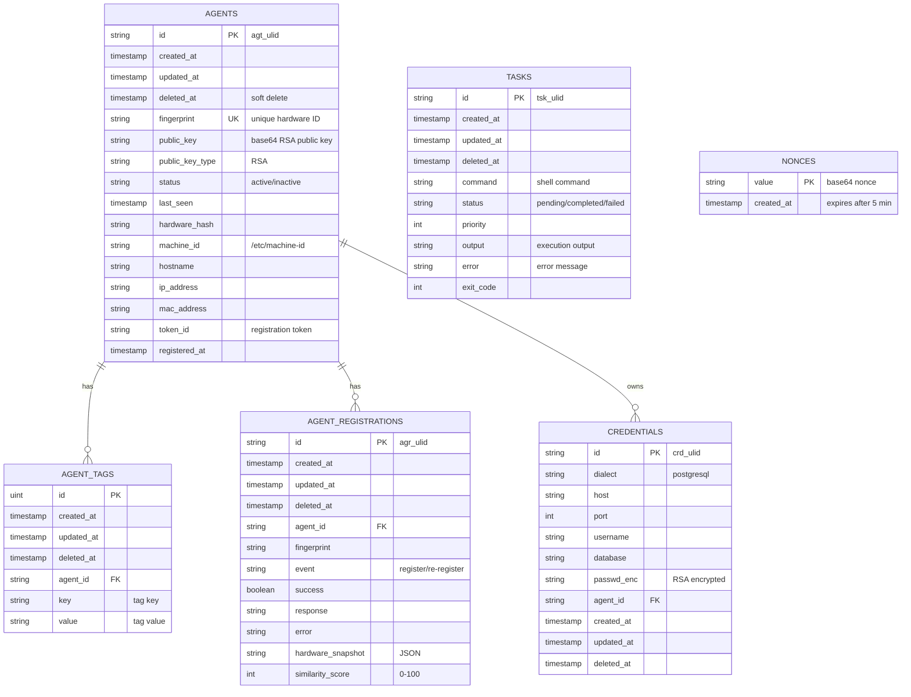
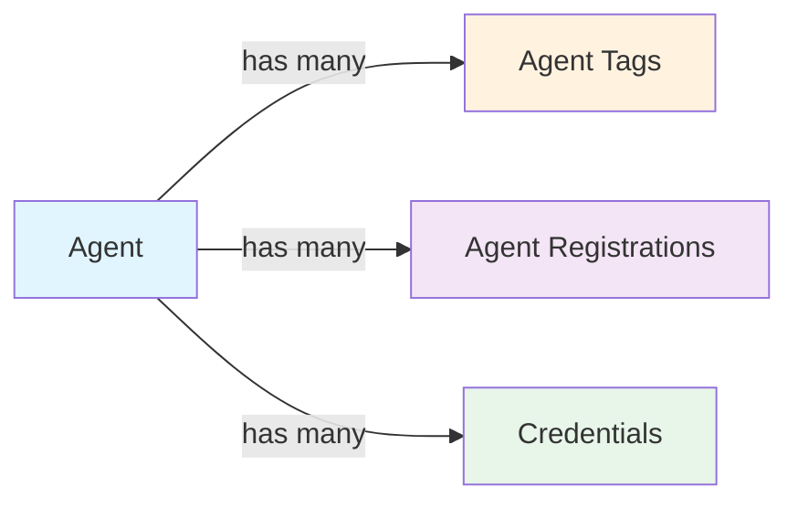

# Hostlink Database Schema

This document provides a detailed reference for all database tables, relationships, and constraints in Hostlink.

## Overview

Hostlink uses GORM for database abstraction and supports both SQLite (development) and PostgreSQL (production). All tables include soft-delete support through the `deleted_at` field.

## Entity Relationship Diagram



---

## Tables

### 1. agents

**Purpose**: Stores registered agent information and hardware fingerprints.

| Column | Type | Constraints | Description |
|--------|------|-------------|-------------|
| `id` | STRING | PRIMARY KEY | Agent identifier (format: `agt_<ulid>`) |
| `created_at` | TIMESTAMP | NOT NULL | Agent creation timestamp |
| `updated_at` | TIMESTAMP | NOT NULL | Last update timestamp |
| `deleted_at` | TIMESTAMP | NULL | Soft delete timestamp |
| `fingerprint` | STRING | UNIQUE, NOT NULL | Unique hardware fingerprint (UUID) |
| `public_key` | TEXT | NOT NULL | RSA public key (base64-encoded) |
| `public_key_type` | STRING | NOT NULL | Key type (always "RSA") |
| `status` | STRING | NOT NULL | Agent status (active/inactive) |
| `last_seen` | TIMESTAMP | NOT NULL | Last heartbeat timestamp |
| `hardware_hash` | STRING | | Combined hardware hash |
| `machine_id` | STRING | | System machine ID from `/etc/machine-id` |
| `hostname` | STRING | | System hostname |
| `ip_address` | STRING | | Primary IP address |
| `mac_address` | STRING | | Primary MAC address |
| `token_id` | STRING | | Registration token identifier |
| `registered_at` | TIMESTAMP | NOT NULL | Initial registration timestamp |

**Indexes**:
- PRIMARY KEY: `id`
- UNIQUE INDEX: `fingerprint`
- INDEX: `status` (for filtering active agents)
- INDEX: `deleted_at` (for soft delete queries)

**Sample Data**:
```sql
INSERT INTO agents (
    id, fingerprint, public_key, public_key_type, status,
    hardware_hash, machine_id, hostname, ip_address, mac_address,
    token_id, registered_at, last_seen, created_at, updated_at
) VALUES (
    'agt_01HQWE123ABC',
    'a1b2c3d4-e5f6-7890-abcd-ef1234567890',
    'LS0tLS1CRUdJTiBQVUJMSUMgS0VZLS0tLS0...',
    'RSA',
    'active',
    'sha256:abc123...',
    'f8d3a2b1c5e4...',
    'server1.example.com',
    '192.168.1.10',
    '00:1A:2B:3C:4D:5E',
    'token_xyz789',
    '2024-11-20 08:00:00',
    '2024-11-22 10:30:00',
    '2024-11-20 08:00:00',
    '2024-11-22 10:30:00'
);
```

---

### 2. agent_tags

**Purpose**: Stores key-value metadata tags for agents.

| Column | Type | Constraints | Description |
|--------|------|-------------|-------------|
| `id` | UINT | PRIMARY KEY AUTO_INCREMENT | Tag identifier |
| `created_at` | TIMESTAMP | NOT NULL | Tag creation timestamp |
| `updated_at` | TIMESTAMP | NOT NULL | Last update timestamp |
| `deleted_at` | TIMESTAMP | NULL | Soft delete timestamp |
| `agent_id` | STRING | FOREIGN KEY, NOT NULL | Reference to `agents.id` |
| `key` | STRING | NOT NULL | Tag key (e.g., "hostname", "os") |
| `value` | STRING | NOT NULL | Tag value (e.g., "server1", "linux") |

**Relationships**:
- FOREIGN KEY: `agent_id` → `agents.id` (ON DELETE CASCADE)

**Indexes**:
- PRIMARY KEY: `id`
- INDEX: `agent_id` (for efficient joins)
- INDEX: `key` (for filtering by tag key)

**Sample Data**:
```sql
INSERT INTO agent_tags (agent_id, key, value, created_at, updated_at) VALUES
    ('agt_01HQWE123ABC', 'hostname', 'server1', NOW(), NOW()),
    ('agt_01HQWE123ABC', 'os', 'linux', NOW(), NOW()),
    ('agt_01HQWE123ABC', 'environment', 'production', NOW(), NOW());
```

**Common Tag Keys**:
- `hostname` - System hostname (automatically generated)
- `os` - Operating system (automatically generated: linux, darwin, windows)
- `environment` - Environment name (user-defined: production, staging, development)
- `region` - Geographic region (user-defined: us-east-1, eu-west-1)
- `role` - Server role (user-defined: web, database, cache)

---

### 3. agent_registrations

**Purpose**: Audit log of all agent registration and re-registration events.

| Column | Type | Constraints | Description |
|--------|------|-------------|-------------|
| `id` | STRING | PRIMARY KEY | Registration record ID (format: `agr_<ulid>`) |
| `created_at` | TIMESTAMP | NOT NULL | Registration event timestamp |
| `updated_at` | TIMESTAMP | NOT NULL | Last update timestamp |
| `deleted_at` | TIMESTAMP | NULL | Soft delete timestamp |
| `agent_id` | STRING | FOREIGN KEY, NOT NULL | Reference to `agents.id` |
| `fingerprint` | STRING | NOT NULL | Fingerprint at time of registration |
| `event` | STRING | NOT NULL | Event type: "register" or "re-register" |
| `success` | BOOLEAN | NOT NULL | Whether registration succeeded |
| `response` | TEXT | | Server response message |
| `error` | TEXT | | Error message if failed |
| `hardware_snapshot` | TEXT | | JSON snapshot of hardware at registration |
| `similarity_score` | INTEGER | | Hardware similarity score (0-100) |

**Relationships**:
- FOREIGN KEY: `agent_id` → `agents.id` (ON DELETE CASCADE)

**Indexes**:
- PRIMARY KEY: `id`
- INDEX: `agent_id` (for agent registration history)
- INDEX: `created_at` (for chronological queries)
- INDEX: `event` (for filtering by registration type)

**Sample Data**:
```sql
INSERT INTO agent_registrations (
    id, agent_id, fingerprint, event, success, response,
    hardware_snapshot, similarity_score, created_at, updated_at
) VALUES (
    'agr_01HQWE456DEF',
    'agt_01HQWE123ABC',
    'a1b2c3d4-e5f6-7890-abcd-ef1234567890',
    'register',
    true,
    'Agent successfully registered',
    '{"machine_id":"f8d3a2b1c5e4","hostname":"server1","mac":"00:1A:2B:3C:4D:5E"}',
    100,
    '2024-11-20 08:00:00',
    '2024-11-20 08:00:00'
);
```

**Event Types**:
- `register` - Initial agent registration
- `re-register` - Agent re-registration (hardware change detected)

---

### 4. tasks

**Purpose**: Stores shell commands to be executed by agents.

| Column | Type | Constraints | Description |
|--------|------|-------------|-------------|
| `id` | STRING | PRIMARY KEY | Task identifier (format: `tsk_<ulid>`) |
| `created_at` | TIMESTAMP | NOT NULL | Task creation timestamp |
| `updated_at` | TIMESTAMP | NOT NULL | Last update timestamp |
| `deleted_at` | TIMESTAMP | NULL | Soft delete timestamp |
| `command` | TEXT | NOT NULL | Shell command to execute |
| `status` | STRING | NOT NULL | Task status (pending/completed/failed) |
| `priority` | INTEGER | DEFAULT 0 | Task priority (higher = more important) |
| `output` | TEXT | | Command execution output (stdout + stderr) |
| `error` | TEXT | | Error message if execution failed |
| `exit_code` | INTEGER | DEFAULT 0 | Process exit code |

**Indexes**:
- PRIMARY KEY: `id`
- INDEX: `status` (for fetching pending tasks)
- INDEX: `priority` (for task prioritization)
- INDEX: `created_at` (for chronological sorting)

**Sample Data**:
```sql
INSERT INTO tasks (
    id, command, status, priority, output, error, exit_code,
    created_at, updated_at
) VALUES (
    'tsk_01HQWE789GHI',
    'uptime',
    'completed',
    1,
    ' 10:30:15 up 5 days, 12:34,  2 users,  load average: 0.50, 0.45, 0.40',
    '',
    0,
    '2024-11-22 10:30:00',
    '2024-11-22 10:30:15'
);
```

**Status Values**:
- `pending` - Task created, waiting for agent to execute
- `completed` - Task executed (may have non-zero exit code)
- `failed` - Task execution failed (error during execution setup)

**Priority Levels**:
- `0` - Normal priority (default)
- `1-5` - Higher priority (processed first)
- Negative values - Lower priority (processed last)

---

### 5. nonces

**Purpose**: Prevents replay attacks by tracking used nonces.

| Column | Type | Constraints | Description |
|--------|------|-------------|-------------|
| `value` | STRING | PRIMARY KEY | Base64-encoded nonce value (16 bytes) |
| `created_at` | TIMESTAMP | NOT NULL | Nonce creation timestamp |

**Indexes**:
- PRIMARY KEY: `value`
- INDEX: `created_at` (for expiry cleanup)

**Sample Data**:
```sql
INSERT INTO nonces (value, created_at) VALUES
    ('abc123xyz789==', '2024-11-22 10:30:00'),
    ('def456uvw012==', '2024-11-22 10:30:05');
```

**Cleanup Policy**:
- Nonces expire after **5 minutes**
- Automatic cleanup via background job or database trigger
- Cleanup query:
  ```sql
  DELETE FROM nonces WHERE created_at < NOW() - INTERVAL 5 MINUTE;
  ```

**Nonce Generation**:
- 16 random bytes generated using `crypto/rand`
- Base64 URL encoding (without padding)
- Unique per request

---

### 6. credentials

**Purpose**: Stores database credentials for metrics collection.

| Column | Type | Constraints | Description |
|--------|------|-------------|-------------|
| `id` | STRING | PRIMARY KEY | Credential identifier (format: `crd_<ulid>`) |
| `dialect` | STRING | NOT NULL | Database dialect (postgresql, mysql) |
| `host` | STRING | NOT NULL | Database host |
| `port` | INTEGER | NOT NULL | Database port |
| `username` | STRING | NOT NULL | Database username |
| `database` | STRING | NOT NULL | Database name |
| `passwd_enc` | TEXT | NOT NULL | RSA-encrypted password (base64) |
| `agent_id` | STRING | FOREIGN KEY, NOT NULL | Reference to `agents.id` |
| `created_at` | TIMESTAMP | NOT NULL | Credential creation timestamp |
| `updated_at` | TIMESTAMP | NOT NULL | Last update timestamp |
| `deleted_at` | TIMESTAMP | NULL | Soft delete timestamp |

**Relationships**:
- FOREIGN KEY: `agent_id` → `agents.id` (ON DELETE CASCADE)

**Indexes**:
- PRIMARY KEY: `id`
- INDEX: `agent_id` (for fetching agent credentials)
- INDEX: `dialect` (for filtering by database type)

**Sample Data**:
```sql
INSERT INTO credentials (
    id, dialect, host, port, username, database, passwd_enc, agent_id,
    created_at, updated_at
) VALUES (
    'crd_01HQWE012JKL',
    'postgresql',
    'db.example.com',
    5432,
    'dbuser',
    'production',
    'LS0tLS1CRUdJTiBSU0EgUFJJVkFURSBLRVktLS0tLS...',
    'agt_01HQWE123ABC',
    '2024-11-22 10:00:00',
    '2024-11-22 10:00:00'
);
```

**Supported Dialects**:
- `postgresql` - PostgreSQL database
- `mysql` - MySQL/MariaDB (future support)
- `mongodb` - MongoDB (future support)

**Password Encryption**:
- Encrypted with agent's **public key** using RSA-OAEP
- Agent decrypts with its **private key**
- Never stored or transmitted in plaintext

---

## Relationships

### One-to-Many Relationships



1. **Agent → Agent Tags**
   - One agent can have multiple tags
   - Tags are automatically loaded with agent (GORM preloading)
   - Tags cascade delete when agent is deleted

2. **Agent → Agent Registrations**
   - One agent can have multiple registration records
   - Maintains full audit history
   - Registrations cascade delete when agent is deleted

3. **Agent → Credentials**
   - One agent can have multiple database credentials
   - Credentials are fetched separately (not preloaded)
   - Credentials cascade delete when agent is deleted

### Independent Tables

- **Tasks**: No direct foreign key to agents
  - Agents fetch tasks by status (polling model)
  - Future: Add `agent_id` column for targeted task assignment

- **Nonces**: Independent table for request validation
  - No relationships to other tables
  - Short-lived (5-minute expiry)

---

## Database Migrations

Hostlink uses GORM's AutoMigrate feature to manage schema changes.

**Migration Code** (`app/app.go`):
```go
db.AutoMigrate(
    &agent.Agent{},
    &agent.AgentTag{},
    &agent.AgentRegistration{},
    &task.Task{},
    &nonce.Nonce{},
    &credential.Credential{},
)
```

**Migration Behavior**:
- Creates tables if they don't exist
- Adds missing columns to existing tables
- **Does NOT** drop columns (safe for production)
- **Does NOT** modify existing column types
- Creates indexes automatically based on GORM tags

**Manual Migrations**:
For complex schema changes, create manual migration scripts:

```sql
-- Example: Add new column
ALTER TABLE agents ADD COLUMN region VARCHAR(255);

-- Example: Create index
CREATE INDEX idx_agents_region ON agents(region);

-- Example: Modify column (PostgreSQL)
ALTER TABLE tasks ALTER COLUMN priority SET DEFAULT 0;
```

---

## Common Queries

### Find Agent by Fingerprint
```sql
SELECT * FROM agents
WHERE fingerprint = 'a1b2c3d4-e5f6-7890-abcd-ef1234567890'
AND deleted_at IS NULL;
```

### Get Agent with Tags
```sql
SELECT a.*, t.key, t.value
FROM agents a
LEFT JOIN agent_tags t ON a.id = t.agent_id
WHERE a.id = 'agt_01HQWE123ABC'
AND a.deleted_at IS NULL
AND t.deleted_at IS NULL;
```

### Get Pending Tasks
```sql
SELECT * FROM tasks
WHERE status = 'pending'
AND deleted_at IS NULL
ORDER BY priority DESC, created_at ASC;
```

### Get Agent Registration History
```sql
SELECT * FROM agent_registrations
WHERE agent_id = 'agt_01HQWE123ABC'
AND deleted_at IS NULL
ORDER BY created_at DESC;
```

### Check if Nonce Exists (Replay Prevention)
```sql
SELECT COUNT(*) FROM nonces
WHERE value = 'abc123xyz789=='
AND created_at > NOW() - INTERVAL 5 MINUTE;
```

### Get Active Agents
```sql
SELECT * FROM agents
WHERE status = 'active'
AND deleted_at IS NULL
AND last_seen > NOW() - INTERVAL 1 HOUR
ORDER BY last_seen DESC;
```

### Get Task Statistics
```sql
SELECT
    status,
    COUNT(*) as count,
    AVG(exit_code) as avg_exit_code
FROM tasks
WHERE deleted_at IS NULL
GROUP BY status;
```

### Get Agent Credentials
```sql
SELECT * FROM credentials
WHERE agent_id = 'agt_01HQWE123ABC'
AND deleted_at IS NULL;
```

---

## Database Maintenance

### Cleanup Expired Nonces
```sql
DELETE FROM nonces
WHERE created_at < NOW() - INTERVAL 5 MINUTE;
```

**Recommended Schedule**: Every 10 minutes via cron or background job

### Archive Completed Tasks
```sql
-- Move to archive table
INSERT INTO tasks_archive
SELECT * FROM tasks
WHERE status = 'completed'
AND updated_at < NOW() - INTERVAL 30 DAY;

-- Soft delete from main table
UPDATE tasks
SET deleted_at = NOW()
WHERE status = 'completed'
AND updated_at < NOW() - INTERVAL 30 DAY;
```

**Recommended Schedule**: Daily

### Update Agent Last Seen
```sql
UPDATE agents
SET last_seen = NOW(), updated_at = NOW()
WHERE id = 'agt_01HQWE123ABC';
```

**Triggered By**: Heartbeat requests from agent

### Purge Soft-Deleted Records
```sql
-- Permanently delete records older than 90 days
DELETE FROM agents WHERE deleted_at < NOW() - INTERVAL 90 DAY;
DELETE FROM tasks WHERE deleted_at < NOW() - INTERVAL 90 DAY;
DELETE FROM agent_tags WHERE deleted_at < NOW() - INTERVAL 90 DAY;
DELETE FROM agent_registrations WHERE deleted_at < NOW() - INTERVAL 90 DAY;
DELETE FROM credentials WHERE deleted_at < NOW() - INTERVAL 90 DAY;
```

**Recommended Schedule**: Monthly

---

## Performance Optimization

### Recommended Indexes

```sql
-- Agents
CREATE INDEX idx_agents_status ON agents(status) WHERE deleted_at IS NULL;
CREATE INDEX idx_agents_last_seen ON agents(last_seen) WHERE deleted_at IS NULL;
CREATE INDEX idx_agents_fingerprint ON agents(fingerprint);

-- Tasks
CREATE INDEX idx_tasks_status ON tasks(status) WHERE deleted_at IS NULL;
CREATE INDEX idx_tasks_priority_created ON tasks(priority DESC, created_at ASC);

-- Agent Tags
CREATE INDEX idx_agent_tags_agent_id ON agent_tags(agent_id);
CREATE INDEX idx_agent_tags_key_value ON agent_tags(key, value);

-- Agent Registrations
CREATE INDEX idx_agent_registrations_agent_id ON agent_registrations(agent_id);
CREATE INDEX idx_agent_registrations_created ON agent_registrations(created_at DESC);

-- Nonces
CREATE INDEX idx_nonces_created_at ON nonces(created_at);

-- Credentials
CREATE INDEX idx_credentials_agent_id ON credentials(agent_id);
CREATE INDEX idx_credentials_dialect ON credentials(dialect);
```

### Query Optimization Tips

1. **Always include `deleted_at IS NULL`** for soft-deleted tables
2. **Use pagination** for large result sets (LIMIT/OFFSET)
3. **Preload relationships** with GORM to avoid N+1 queries
4. **Use covering indexes** for frequently-queried columns
5. **Partition large tables** by date (e.g., tasks, registrations)

---

## Database Backup

### SQLite Backup
```bash
# Backup database file
cp /var/lib/hostlink/hostlink.db /backup/hostlink-$(date +%Y%m%d).db

# Compress backup
gzip /backup/hostlink-$(date +%Y%m%d).db
```

### PostgreSQL Backup
```bash
# Full database dump
pg_dump -h localhost -U dbuser -d hostlink > /backup/hostlink-$(date +%Y%m%d).sql

# Compressed dump
pg_dump -h localhost -U dbuser -d hostlink | gzip > /backup/hostlink-$(date +%Y%m%d).sql.gz

# Schema only
pg_dump -h localhost -U dbuser -d hostlink --schema-only > /backup/schema-$(date +%Y%m%d).sql
```

### Restore
```bash
# SQLite
cp /backup/hostlink-20241122.db /var/lib/hostlink/hostlink.db

# PostgreSQL
psql -h localhost -U dbuser -d hostlink < /backup/hostlink-20241122.sql
```

---

## Database Size Estimates

Estimated storage requirements (approximate):

| Table | Average Row Size | 1K Agents | 10K Agents | 100K Agents |
|-------|------------------|-----------|------------|-------------|
| agents | 500 bytes | 500 KB | 5 MB | 50 MB |
| agent_tags | 100 bytes | 300 KB (3 tags/agent) | 3 MB | 30 MB |
| agent_registrations | 300 bytes | 300 KB | 3 MB | 30 MB |
| tasks | 1 KB | 10 MB (10 tasks/agent) | 100 MB | 1 GB |
| nonces | 50 bytes | Negligible (short-lived) | | |
| credentials | 500 bytes | 500 KB | 5 MB | 50 MB |
| **Total** | | **~12 MB** | **~116 MB** | **~1.16 GB** |

**Notes**:
- Task storage grows with task history
- Regular cleanup of old tasks recommended
- Nonces are automatically cleaned every 5 minutes

---

## Database Configuration

### SQLite Configuration

**File**: `config/environments/development/devconf.go`
```go
DBUrl: "file:hostlink.db"
```

**Connection String Options**:
```
file:hostlink.db?cache=shared&mode=rwc&_journal_mode=WAL
```

**Recommended Settings**:
- Journal mode: WAL (Write-Ahead Logging)
- Cache: Shared
- Mode: Read-Write-Create

### PostgreSQL Configuration

**File**: `config/environments/production/prodconf.go`
```
host=localhost port=5432 user=dbuser password=dbpass dbname=hostlink sslmode=require
```

**Recommended Settings**:
- `max_connections`: 100
- `shared_buffers`: 256MB
- `effective_cache_size`: 1GB
- `maintenance_work_mem`: 64MB
- `wal_buffers`: 16MB

---

## Security Considerations

1. **Soft Deletes**: All tables support soft deletes to prevent data loss
2. **Password Encryption**: Credentials stored with RSA encryption
3. **Nonce Validation**: Prevents replay attacks with 5-minute expiry
4. **Public Key Storage**: Public keys stored in plaintext (not sensitive)
5. **Audit Trail**: Agent registrations maintain full history

---

## Troubleshooting

### Migration Failures

**Issue**: AutoMigrate fails to create tables

**Solution**:
```go
// Enable debug logging
db.Logger = logger.Default.LogMode(logger.Info)
db.AutoMigrate(&agent.Agent{})
```

### Soft Delete Not Working

**Issue**: Deleted records still appear in queries

**Solution**: Always include `deleted_at IS NULL` in WHERE clauses
```sql
-- Correct
SELECT * FROM agents WHERE deleted_at IS NULL;

-- Incorrect (includes soft-deleted)
SELECT * FROM agents;
```

### Nonce Table Growing Large

**Issue**: Nonces table consuming too much space

**Solution**: Ensure cleanup job is running
```sql
-- Check nonce count
SELECT COUNT(*) FROM nonces;

-- Check oldest nonce
SELECT MIN(created_at) FROM nonces;

-- Manual cleanup
DELETE FROM nonces WHERE created_at < NOW() - INTERVAL 5 MINUTE;
```

---

## References

- [GORM Documentation](https://gorm.io/docs/)
- [SQLite Documentation](https://www.sqlite.org/docs.html)
- [PostgreSQL Documentation](https://www.postgresql.org/docs/)
- [ULID Specification](https://github.com/ulid/spec)
