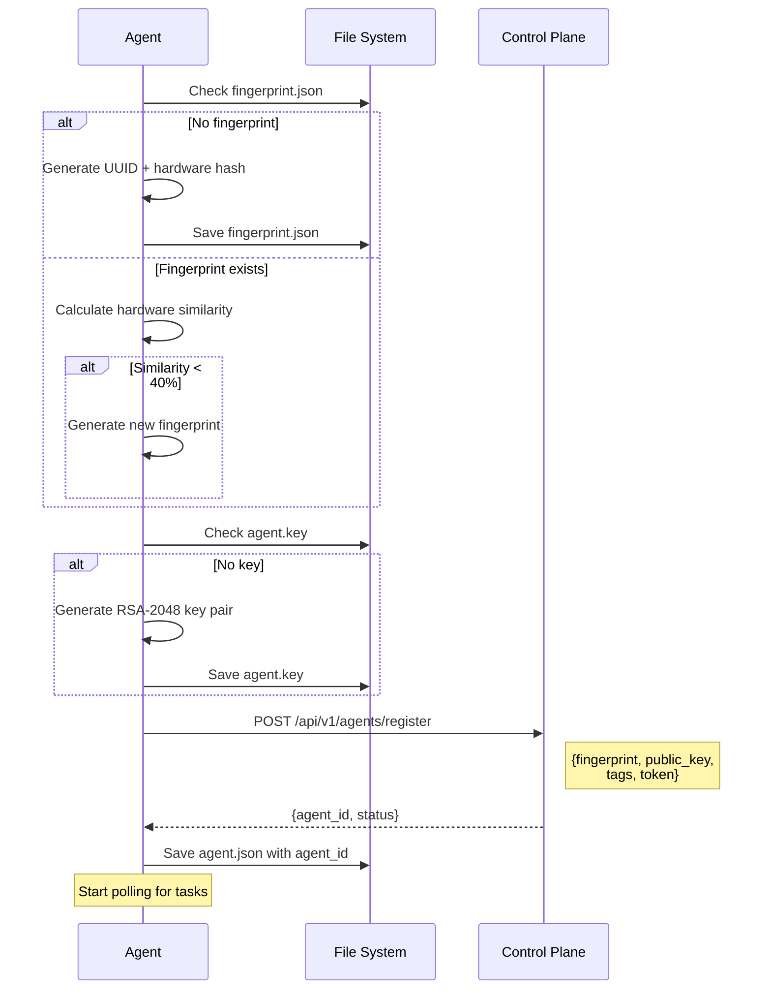
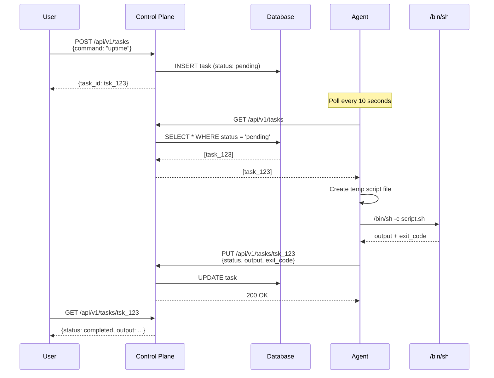
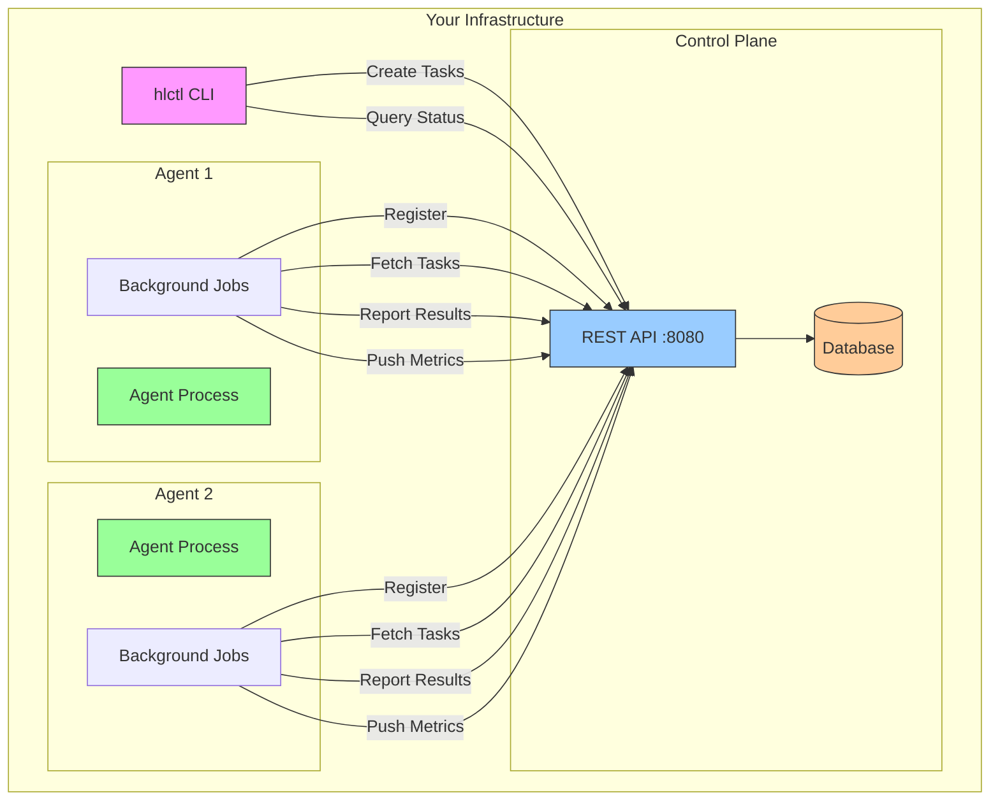

# Getting Started with Hostlink

This guide will help you quickly set up and start using Hostlink for remote task execution and monitoring.

## Table of Contents
1. [Quick Start](#quick-start)
2. [Installation](#installation)
3. [Running the Control Plane](#running-the-control-plane)
4. [Setting Up an Agent](#setting-up-an-agent)
5. [Creating and Running Tasks](#creating-and-running-tasks)
6. [Using hlctl CLI](#using-hlctl-cli)
7. [Next Steps](#next-steps)

---

## Quick Start

Get Hostlink running in 5 minutes:

```bash
# Clone the repository
git clone https://github.com/yourusername/hostlink.git
cd hostlink

# Run tests to verify setup
make test

# Build binaries
make build
make build-hlctl

# Start control plane server
./bin/hostlink

# In another terminal, set up agent
export SH_CONTROL_PLANE_URL="http://localhost:8080"
export HOSTLINK_TOKEN_ID="demo_token"
export HOSTLINK_TOKEN_KEY="demo_key"
./bin/hostlink

# In another terminal, create a task
export HOSTLINK_SERVER_URL="http://localhost:8080"
./bin/hlctl task create --command "echo 'Hello, Hostlink!'"

# View task results
./bin/hlctl task list
```

---

## Installation

### Prerequisites

- **Go 1.21+** - [Install Go](https://golang.org/dl/)
- **Git** - For cloning the repository
- **SQLite** or **PostgreSQL** - Database (SQLite included by default)

### Clone Repository

```bash
git clone https://github.com/yourusername/hostlink.git
cd hostlink
```

### Build from Source

```bash
# Build control plane server and agent (same binary)
make build

# Build hlctl CLI tool
make build-hlctl

# Run tests
make test

# Run integration tests
make test-it

# Run all tests in Docker
make test-in-docker
```

**Binaries**:
- `bin/hostlink` - Control plane server & agent
- `bin/hlctl` - CLI management tool

---

## Running the Control Plane

The control plane is the central server that manages agents and tasks.

### Development Mode

```bash
# Uses SQLite database (file:hostlink.db)
# Listens on http://localhost:8080
make dev
```

Or manually:
```bash
export APP_ENV=development
export SH_APP_PORT=8080
export SH_DB_URL="file:hostlink.db"
./bin/hostlink
```

### Production Mode

```bash
# Set environment
export APP_ENV=production

# Configure database (PostgreSQL recommended)
export SH_DB_URL="host=localhost port=5432 user=dbuser password=dbpass dbname=hostlink sslmode=require"

# Configure port
export SH_APP_PORT=8080

# Start server
./bin/hostlink
```

### Verify Server is Running

```bash
curl http://localhost:8080/health
# Response: {"status":"ok"}
```

### Control Plane Endpoints

Once running, the control plane exposes:
- **API**: `http://localhost:8080/api/v1/*`
- **Health**: `http://localhost:8080/health`
- **UI**: `http://localhost:8080/` (static UI)

---

## Setting Up an Agent

Agents register with the control plane and execute tasks.

### Step 1: Configure Agent

```bash
# Control plane URL
export SH_CONTROL_PLANE_URL="http://localhost:8080"

# Registration credentials
export HOSTLINK_TOKEN_ID="your_token_id"
export HOSTLINK_TOKEN_KEY="your_token_key"

# Optional: Custom file paths
export HOSTLINK_PRIVATE_KEY_PATH="/var/lib/hostlink/agent.key"
export HOSTLINK_FINGERPRINT_PATH="/var/lib/hostlink/fingerprint.json"
export HOSTLINK_STATE_PATH="/var/lib/hostlink"
```

### Step 2: Start Agent

```bash
# Same binary as control plane, but configured as agent
./bin/hostlink
```

### Step 3: Verify Registration

Check agent logs for:
```
INFO Agent registered successfully: agt_01HQWE123ABC
```

Or check with hlctl:
```bash
./bin/hlctl agent list
```

### What Happens During Registration?



---

## Creating and Running Tasks

### Using API Directly

```bash
# Create task
curl -X POST http://localhost:8080/api/v1/tasks \
  -H "Content-Type: application/json" \
  -d '{
    "command": "uptime",
    "priority": 1
  }'

# Response
{
  "id": "tsk_01HQWE789GHI",
  "command": "uptime",
  "status": "pending",
  "priority": 1,
  "created_at": "2024-11-22T10:30:00Z"
}

# Check task status
curl http://localhost:8080/api/v1/tasks/tsk_01HQWE789GHI

# List all tasks
curl http://localhost:8080/api/v1/tasks
```

### Task Execution Flow



---

## Using hlctl CLI

The `hlctl` tool provides a convenient command-line interface for managing agents and tasks.

### Setup

```bash
# Configure server URL
export HOSTLINK_SERVER_URL="http://localhost:8080"

# Or use config file
mkdir -p ~/.hostlink
cat > ~/.hostlink/config.yml <<EOF
server: http://localhost:8080
EOF
```

### Agent Commands

```bash
# List all agents
./bin/hlctl agent list

# Get agent details
./bin/hlctl agent get agt_01HQWE123ABC

# Filter agents by status
./bin/hlctl agent list --status active
```

**Example Output**:
```
ID                    FINGERPRINT                         STATUS   HOSTNAME   LAST SEEN
agt_01HQWE123ABC     a1b2c3d4-e5f6-7890-abcd-ef123456   active   server1    2024-11-22 10:30:00
```

### Task Commands

```bash
# Create task
./bin/hlctl task create --command "echo 'Hello, World!'"

# Create high-priority task
./bin/hlctl task create --command "apt-get update" --priority 5

# List all tasks
./bin/hlctl task list

# List pending tasks only
./bin/hlctl task list --status pending

# Get task details
./bin/hlctl task get tsk_01HQWE789GHI

# Watch task status (polls every 2 seconds)
./bin/hlctl task watch tsk_01HQWE789GHI
```

**Example Task Output**:
```
ID: tsk_01HQWE789GHI
Command: uptime
Status: completed
Priority: 1
Output:
 10:30:15 up 5 days, 12:34,  2 users,  load average: 0.50, 0.45, 0.40
Error:
Exit Code: 0
Created: 2024-11-22 10:30:00
Updated: 2024-11-22 10:30:15
```

### Useful hlctl Patterns

```bash
# Create and watch task in one command
TASK_ID=$(./bin/hlctl task create --command "sleep 10 && echo 'done'" | jq -r .id)
./bin/hlctl task watch $TASK_ID

# Run command on all agents (via broadcast task)
./bin/hlctl task create --command "df -h"

# Schedule maintenance task
./bin/hlctl task create --command "apt-get update && apt-get upgrade -y" --priority 10

# Check recent task history
./bin/hlctl task list --limit 10

# Export task results to JSON
./bin/hlctl task get tsk_123 --output json > task-results.json
```

---

## Common Use Cases

### 1. System Monitoring

```bash
# Check disk space across all agents
./bin/hlctl task create --command "df -h"

# Check memory usage
./bin/hlctl task create --command "free -m"

# Check system uptime
./bin/hlctl task create --command "uptime"
```

### 2. Package Management

```bash
# Update package lists
./bin/hlctl task create --command "apt-get update"

# Install package
./bin/hlctl task create --command "apt-get install -y nginx"

# Check installed packages
./bin/hlctl task create --command "dpkg -l | grep nginx"
```

### 3. Service Management

```bash
# Restart service
./bin/hlctl task create --command "systemctl restart nginx"

# Check service status
./bin/hlctl task create --command "systemctl status nginx"

# View service logs
./bin/hlctl task create --command "journalctl -u nginx -n 50"
```

### 4. File Operations

```bash
# Create backup
./bin/hlctl task create --command "tar -czf /backup/app-\$(date +%Y%m%d).tar.gz /var/www/app"

# Check file permissions
./bin/hlctl task create --command "ls -la /var/www/app"

# Find large files
./bin/hlctl task create --command "find /var/log -type f -size +100M"
```

### 5. Database Operations

```bash
# PostgreSQL backup
./bin/hlctl task create --command "pg_dump -U dbuser mydb > /backup/mydb-\$(date +%Y%m%d).sql"

# Check database size
./bin/hlctl task create --command "psql -U dbuser -c \"SELECT pg_size_pretty(pg_database_size('mydb'));\""

# Vacuum database
./bin/hlctl task create --command "psql -U dbuser -c 'VACUUM ANALYZE;'"
```

---

## Architecture Overview



---

## Configuration Reference

### Control Plane Environment Variables

| Variable | Default | Description |
|----------|---------|-------------|
| `APP_ENV` | development | Environment (development/production) |
| `SH_APP_PORT` | 8080 | Server port |
| `SH_DB_URL` | file:hostlink.db | Database connection string |

### Agent Environment Variables

| Variable | Default | Description |
|----------|---------|-------------|
| `SH_CONTROL_PLANE_URL` | http://localhost:8080 | Control plane URL |
| `HOSTLINK_TOKEN_ID` | (required) | Registration token ID |
| `HOSTLINK_TOKEN_KEY` | (required) | Registration token secret |
| `HOSTLINK_PRIVATE_KEY_PATH` | /var/lib/hostlink/agent.key | RSA private key path |
| `HOSTLINK_FINGERPRINT_PATH` | /var/lib/hostlink/fingerprint.json | Fingerprint file path |
| `HOSTLINK_STATE_PATH` | /var/lib/hostlink | Agent state directory |

### hlctl Environment Variables

| Variable | Default | Description |
|----------|---------|-------------|
| `HOSTLINK_SERVER_URL` | http://localhost:8080 | Control plane URL |

---

## Troubleshooting

### Control Plane Won't Start

**Problem**: Server fails to start

**Solutions**:
```bash
# Check port is available
lsof -i :8080

# Check database connection
export SH_DB_URL="file:hostlink.db"
sqlite3 hostlink.db ".tables"

# Enable debug logging
export LOG_LEVEL=debug
./bin/hostlink
```

### Agent Won't Register

**Problem**: Agent fails to register

**Solutions**:
```bash
# Verify control plane is reachable
curl $SH_CONTROL_PLANE_URL/health

# Check token credentials
echo "Token ID: $HOSTLINK_TOKEN_ID"
echo "Token Key: $HOSTLINK_TOKEN_KEY"

# Check file permissions
ls -la /var/lib/hostlink/

# Create directory if missing
sudo mkdir -p /var/lib/hostlink
sudo chown $USER:$USER /var/lib/hostlink
```

### Tasks Not Executing

**Problem**: Tasks stay in "pending" status

**Solutions**:
```bash
# Verify agent is running
ps aux | grep hostlink

# Check agent logs
tail -f /var/log/hostlink/agent.log

# Verify agent is registered
./bin/hlctl agent list

# Check agent state
cat /var/lib/hostlink/agent.json
```

### hlctl Connection Failed

**Problem**: hlctl cannot connect to server

**Solutions**:
```bash
# Verify server URL
echo $HOSTLINK_SERVER_URL

# Test connectivity
curl $HOSTLINK_SERVER_URL/health

# Use explicit server flag
./bin/hlctl --server http://localhost:8080 agent list
```

---

## Next Steps

Now that you have Hostlink up and running:

1. **Explore the Architecture** - Read [ARCHITECTURE.md](ARCHITECTURE.md) for detailed system design
2. **Review the Database Schema** - See [DATABASE-SCHEMA.md](DATABASE-SCHEMA.md) for table structures
3. **Set Up Metrics Collection** - Configure PostgreSQL credentials for monitoring
4. **Deploy to Production** - Follow production deployment best practices
5. **Write Custom Integration** - Use the API to build custom tools

### Learn More

- [API Reference](ARCHITECTURE.md#api-reference) - Complete API documentation
- [Authentication Flow](ARCHITECTURE.md#authentication-flow) - RSA signature details
- [Security Considerations](ARCHITECTURE.md#security-considerations) - Security best practices
- [Configuration](ARCHITECTURE.md#configuration) - Full configuration guide

---

## Getting Help

- **Documentation**: Check [docs/](docs/) directory
- **Issues**: Report bugs on GitHub Issues
- **Logs**: Check `/var/log/hostlink/` for error messages
- **Health Check**: `curl http://localhost:8080/health`

---

## Quick Reference

### Build Commands
```bash
make build           # Build main binary
make build-hlctl     # Build CLI tool
make test            # Run unit tests
make test-it         # Run integration tests
make dev             # Run development server
```

### Agent Files
```
/var/lib/hostlink/
├── agent.key          # RSA private key (2048-bit)
├── fingerprint.json   # Hardware fingerprint
└── agent.json         # Agent state (agent_id)
```

### Default Ports
- Control Plane: `8080`
- Database: `5432` (PostgreSQL) or file-based (SQLite)

### Task Statuses
- `pending` - Waiting for execution
- `completed` - Executed (check exit_code)
- `failed` - Execution error

### Job Intervals
- Registration: Once on startup (retry 5x with backoff)
- Task Polling: Every 10 seconds
- Metrics Collection: Every 20 seconds

---

Ready to dive deeper? Continue to [ARCHITECTURE.md](ARCHITECTURE.md) for comprehensive system documentation.
