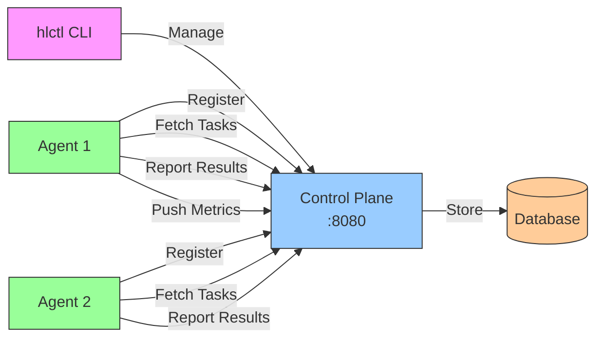
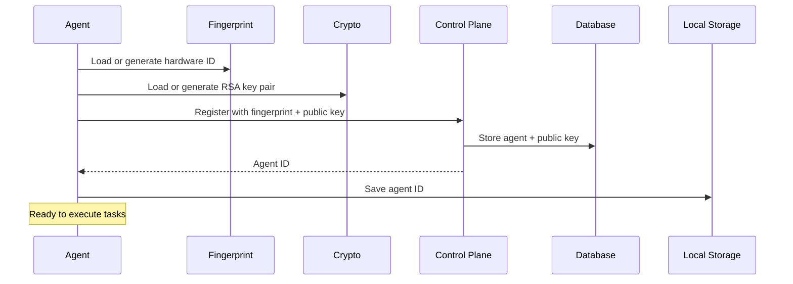
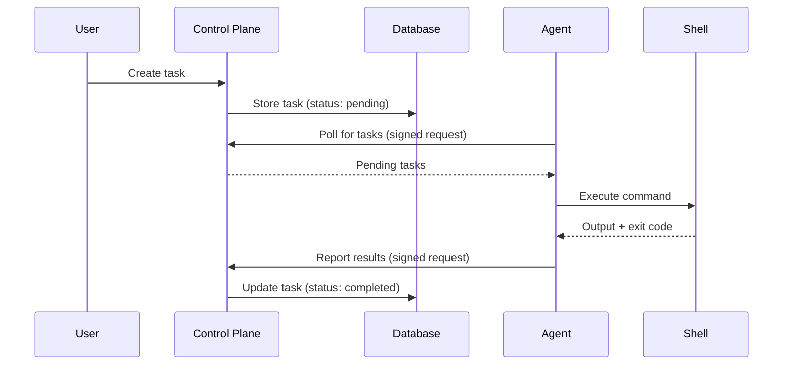
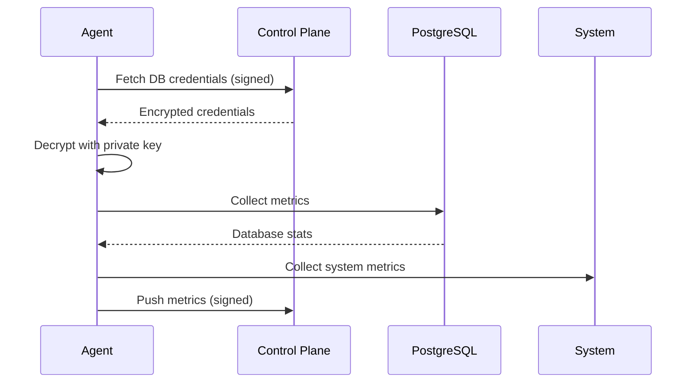

# Hostlink Documentation

Welcome to the Hostlink documentation! This directory contains comprehensive guides, architecture documentation, and references for the Hostlink agent-based task execution system.

## Documentation Index

### 📚 Core Documentation

1. **[Getting Started Guide](GETTING-STARTED.md)** - Quick start guide for new users

   - Installation instructions
   - Running control plane and agents
   - Creating and executing tasks
   - Using the hlctl CLI tool
   - Common use cases and troubleshooting

2. **[Architecture Documentation](ARCHITECTURE.md)** - Comprehensive system architecture

   - High-level architecture diagrams
   - Detailed component descriptions
   - Flow diagrams (registration, task execution, metrics)
   - Authentication and security
   - API reference
   - Configuration guide

3. **[Database Schema](DATABASE-SCHEMA.md)** - Complete database reference
   - Entity relationship diagrams
   - Table definitions and constraints
   - Relationships and indexes
   - Common queries
   - Maintenance and optimization

### 🎯 Quick Links

- **New to Hostlink?** → Start with [Getting Started](GETTING-STARTED.md)
- **Need API details?** → See [Architecture - API Reference](ARCHITECTURE.md#api-reference)
- **Database questions?** → Check [Database Schema](DATABASE-SCHEMA.md)
- **Security concerns?** → Read [Architecture - Security](ARCHITECTURE.md#security-considerations)
- **Deployment help?** → Review [Architecture - Deployment](ARCHITECTURE.md#deployment)

## What is Hostlink?

Hostlink is an agent-based task execution system that enables remote software management on host machines. The system consists of:

- **Control Plane Server** - REST API server managing agents and tasks
- **Agent** - Background service executing tasks on host machines
- **hlctl** - Command-line interface for management

### Key Features

- **One-Way RSA-PSS Authentication** - Secure agent-to-server communication
- **Hardware Fingerprinting** - Unique device identification
- **Remote Task Execution** - Execute shell commands remotely
- **PostgreSQL Metrics** - Database performance monitoring
- **Retry Logic** - Exponential backoff for reliability
- **Atomic Operations** - Safe concurrent file operations

## Architecture at a Glance



## Quick Start

```bash
# Build binaries
make build
make build-hlctl

# Start control plane
./bin/hostlink

# In another terminal, start agent
export SH_CONTROL_PLANE_URL="http://localhost:8080"
export HOSTLINK_TOKEN_ID="demo_token"
export HOSTLINK_TOKEN_KEY="demo_key"
./bin/hostlink

# Create a task
export HOSTLINK_SERVER_URL="http://localhost:8080"
./bin/hlctl task create --command "echo 'Hello, Hostlink!'"

# View results
./bin/hlctl task list
```

For detailed setup instructions, see [Getting Started](GETTING-STARTED.md).

## System Flows

### 1. Agent Registration Flow



### 2. Task Execution Flow



### 3. Metrics Collection Flow



## Documentation Structure

```
docs/
├── README.md              # This file - documentation index
├── GETTING-STARTED.md     # Quick start guide for new users
├── ARCHITECTURE.md        # Comprehensive architecture documentation
└── DATABASE-SCHEMA.md     # Database schema reference
```

## Key Concepts

### Hardware Fingerprinting

Each agent generates a unique fingerprint based on:

- Machine ID (`/etc/machine-id`)
- Hardware hash (CPU, memory, disks)
- MAC address

Fingerprints detect hardware changes with 40% similarity threshold.

### RSA-PSS Authentication

Agents authenticate to the server using digital signatures:

1. Agent signs message: `AgentID|Timestamp|Nonce`
2. Server verifies signature with stored public key
3. Timestamp within ±5 minutes (replay prevention)
4. Nonce used once (replay prevention)

### Background Jobs

Agents run three background jobs:

| Job          | Interval                | Purpose                             |
| ------------ | ----------------------- | ----------------------------------- |
| Registration | Once (retry on failure) | Register with control plane         |
| Task Job     | 10 seconds              | Poll and execute tasks              |
| Metrics Job  | 20 seconds              | Collect and push PostgreSQL metrics |

### Task States

- `pending` - Task created, waiting for execution
- `completed` - Task executed (check exit_code for success)
- `failed` - Execution error (failed to create script, etc.)

## API Endpoints

### Agent Management

- `POST /api/v1/agents/register` - Register agent
- `GET /api/v1/agents` - List agents
- `GET /api/v1/agents/:id` - Get agent details

### Task Management (Authenticated)

- `POST /api/v1/tasks` - Create task
- `GET /api/v1/tasks` - List tasks
- `PUT /api/v1/tasks/:id` - Update task

### Credentials & Metrics (Authenticated)

- `GET /api/v1/agents/:id/credentials` - Get DB credentials
- `POST /api/v1/agents/:id/metrics` - Push metrics

See [API Reference](ARCHITECTURE.md#api-reference) for complete details.

## Database Tables

- **agents** - Registered agent information
- **agent_tags** - Key-value metadata for agents
- **agent_registrations** - Registration history (audit log)
- **tasks** - Shell commands to execute
- **nonces** - One-time use values (replay prevention)
- **credentials** - Database credentials (encrypted)

See [Database Schema](DATABASE-SCHEMA.md) for complete table definitions.

## Configuration

### Environment Variables

**Control Plane**:

- `APP_ENV` - Environment (development/production)
- `SH_APP_PORT` - Server port (default: 8080)
- `SH_DB_URL` - Database connection string

**Agent**:

- `SH_CONTROL_PLANE_URL` - Control plane URL
- `HOSTLINK_TOKEN_ID` - Registration token ID
- `HOSTLINK_TOKEN_KEY` - Registration token secret
- `HOSTLINK_PRIVATE_KEY_PATH` - RSA private key path
- `HOSTLINK_FINGERPRINT_PATH` - Fingerprint file path

**hlctl**:

- `HOSTLINK_SERVER_URL` - Control plane URL

See [Configuration Guide](ARCHITECTURE.md#configuration) for all options.

## Security

### Key Security Features

- **One-way authentication** - Only agent → server (prevents server impersonation)
- **RSA-2048 signatures** - Strong cryptographic authentication
- **Replay attack prevention** - Timestamp + nonce validation
- **Credential encryption** - Passwords encrypted with agent public key
- **Private key protection** - Never transmitted, stored locally only
- **Soft deletes** - Audit trail preserved

See [Security Considerations](ARCHITECTURE.md#security-considerations) for details.

## Deployment

### Production Checklist

- [ ] Use PostgreSQL for database
- [ ] Configure HTTPS for control plane
- [ ] Set up regular database backups
- [ ] Enable log rotation for agents
- [ ] Configure firewall rules (port 8080)
- [ ] Set up monitoring for control plane
- [ ] Create systemd services for agents
- [ ] Implement nonce cleanup job
- [ ] Set appropriate file permissions (0600 for private keys)

See [Deployment Guide](ARCHITECTURE.md#deployment) for step-by-step instructions.

## Troubleshooting

### Common Issues

**Agent won't register**

- Verify control plane URL is reachable
- Check token credentials are correct
- Ensure `/var/lib/hostlink` directory exists and is writable

**Tasks not executing**

- Verify agent is running and registered
- Check agent logs for errors
- Ensure commands are valid shell syntax

**Authentication errors**

- Verify system time is synchronized (±5 minute window)
- Check private key exists and is readable
- Ensure agent ID is saved in state file

See troubleshooting sections in each guide for more help.

## Development

### Running Tests

```bash
# Unit tests
make test

# Integration tests
make test-it

# Smoke tests (requires running server)
make test-smoke

# All tests in Docker
make test-in-docker
```

### Project Structure

```
hostlink/
├── main.go                # Server entry point
├── app/                   # Application layer
│   ├── controller/        # HTTP handlers
│   ├── services/          # Business logic
│   ├── jobs/             # Background jobs
│   └── middleware/       # HTTP middleware
├── domain/               # Domain models
├── internal/             # Internal utilities
│   ├── repository/       # Database implementations
│   ├── crypto/          # RSA operations
│   └── apiserver/       # API client
├── config/              # Configuration
├── cmd/hlctl/           # CLI tool
└── test/                # Test suites
```

## Contributing

Contributions are welcome! Please:

1. Read the architecture documentation
2. Follow existing code patterns
3. Write tests for new features
4. Update documentation for changes
5. Submit pull requests with clear descriptions

## Additional Resources

### Project Files

- [TODO.md](../TODO.md) - Project todos and roadmap

### External Links

- [GORM Documentation](https://gorm.io/docs/) - ORM library
- [Echo Framework](https://echo.labstack.com/) - HTTP framework
- [ULID Specification](https://github.com/ulid/spec) - ID format

## Getting Help

- **Documentation**: Check this docs directory
- **Issues**: Report bugs on GitHub Issues
- **Logs**: Check `/var/log/hostlink/` for error messages
- **Health Check**: `curl http://localhost:8080/health`

## License

See [LICENSE](../LICENSE) for license information.

---

**Ready to get started?** → [Getting Started Guide](GETTING-STARTED.md)

**Need technical details?** → [Architecture Documentation](ARCHITECTURE.md)

**Database questions?** → [Database Schema](DATABASE-SCHEMA.md)
